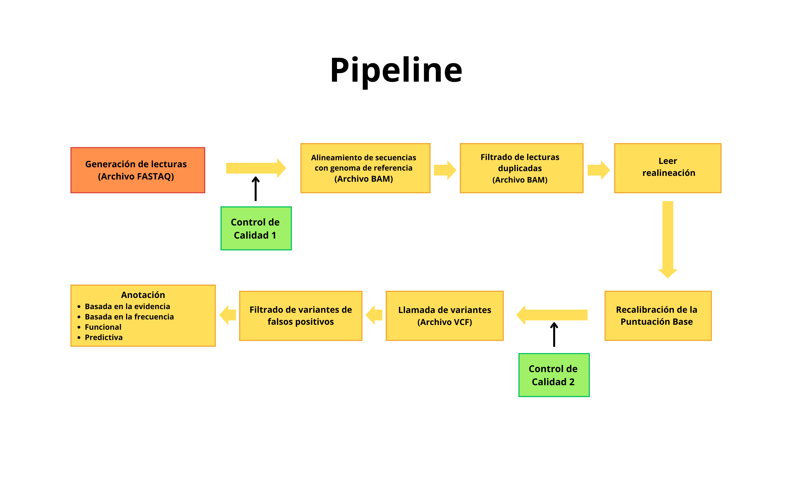

   
**Identificación de mutaciones y diagnóstico genético** 

# 🧬 Análisis de Variantes en el gen *Dsup* de Tardígrados

## Objetivo  
Identificar mutaciones en el gen *Dsup* asociadas a resistencia a radiación en el tardígrado *Ramazzottius varieornatus*, aplicando filtros de calidad (DP > 10, QUAL > 1e-6).  

## 🌟 Resultados Clave  
1. **Variantes en exones de *Dsup***:  
   - **0 mutaciones** detectadas (gen altamente conservado).  
2. **Variantes en intrones**:  
   - **3 variantes totales** (distribuidas en dos intrones) → **0 tras filtrado** (baja cobertura/calidad).
3. **Posiciones Gen *Dsup***:
   - DGG01000015.1:336,949-336,995 (exón 1), BDGG01000015.1:337,421-337,873 (exón 2), DGG01000015.1:337,927-338,774 (exón 3). 
4. **Conclusión**:
   - *Dsup* es altamente conservado, incluso en regiones no codificantes.

## 🛠️ Herramientas y Tecnologías  
- **Plataforma**: Galaxy  
- **Herramientas**:
  - `Trimmomatic`: Limpieza de lecturas RAW (adaptadores, baja calidad).  
  - `Bowtie2`: Mapeo de lecturas al genoma de referencia. 
  - `Samtools`: Conversión, ordenado e indexado de archivos BAM. 
  - `FreeBayes`: Detección de SNPs/indels.  
  - `bcftools view`: Selección de variantes confiables (calidad/cobertura). 
  - **IGV** (visualización).    

## 👀 Visualización  
 

## 🔄 Flujo de Trabajo en Galaxy  
### Pasos Ejecutados  
1. **Control de Calidad**:  
   - FASTQC → Trimmomatic.  
2. **Mapeo**:  
   - Bowtie2 (vs. genoma de referencia) → MarkDuplicates (Eliminar duplicados).  
3. **Llamada de Variantes**:  
   - FreeBayes → Filtrado con bcftools (DP > 10, QUAL > 1e-6).  

**Historial Público en Galaxy**: [Ver análisis completo](https://usegalaxy.org/u/rc_16/h/dsup-variant-analysis)  

## Visualización del Pipeline  

